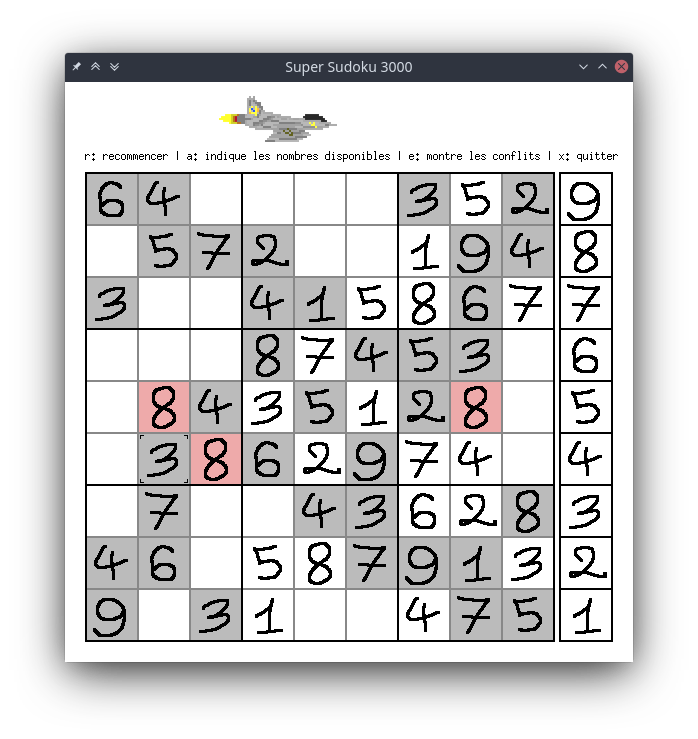

<p align="center">
  
  <h2 align="center">ENS Paris-Saclay · DER Informatique</h2>
  <h3 align="center">Projet de programmation 1</h3>
  <h4 align="center">Super Sudoku 3000</h3>
</p>

---
## À propos
Projet réalisé dans le cadre du cours de Programmation 1 à l'ENS Paris-Saclay. Ce projet a été réalisé avec
le langage OCaml, en s'appuyant sur la bibliothèque Graphics. Il fournit une interface graphique pour jouer
au sudoku au clavier ou à la souris.


Pourquoi recommander Super Sudoku 3000 à ses amis ?
- les cases mal remplies et/ou les seules valeurs utilisables peuvent être indiquées;
- support de la souris;
- ajout de ses propres grilles;
- 60 fps !!!!
- inclut un méchant avion qui cherche à ralentir votre progression.




### Structure (sans fichier compilé)
.  
├── grids : grilles de jeu   
│   ├── 01  
│   ├── 02  
│   └── ...  
├── lib  
│   ├── assets  
│   │   ├── 0.bmp  
│   │   ├── 1.bmp  
│   │   ├── ...  
│   │   ├── 9.bmp  
│   │   └── parser.py  
│   ├── assets.ml : assets utilisées (dessin des chiffres)  
│   └── dynamique.ml : structure de donnée mutable et dynamique  
├── LICENSE.md  
├── Makefile  
├── README.md  
└── src  
    ├── global.ml : variables globales, définitions générales  
    ├── logic.ml : logique du jeu  
    ├── main.ml : routine d'exécution  
    └── render.ml : gestion de l'affichage  

## Installation et dépendances
Ce projet est conçu pour être compilé sous GNU/Linux avec OCaml (>=4.03) en ayant installé
le module Graphics (`libgraphics-ocaml-dev` par exemple sous Debian). La création de
l'exécutable se fait par:

```
make sudoku.bin
```

## Licence et contact
Ce projet appartient au domaine public (voir LICENCE.md pour plus de détails).

Lucas Tabary-Maujean, 🄯2021, [e-mail](mailto:l.ta-ma@pm.me)
